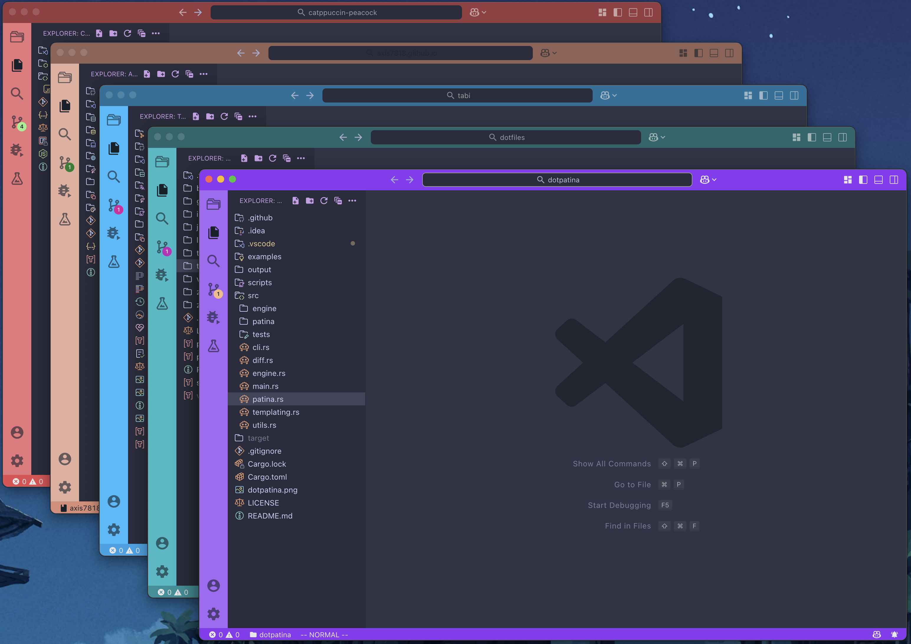
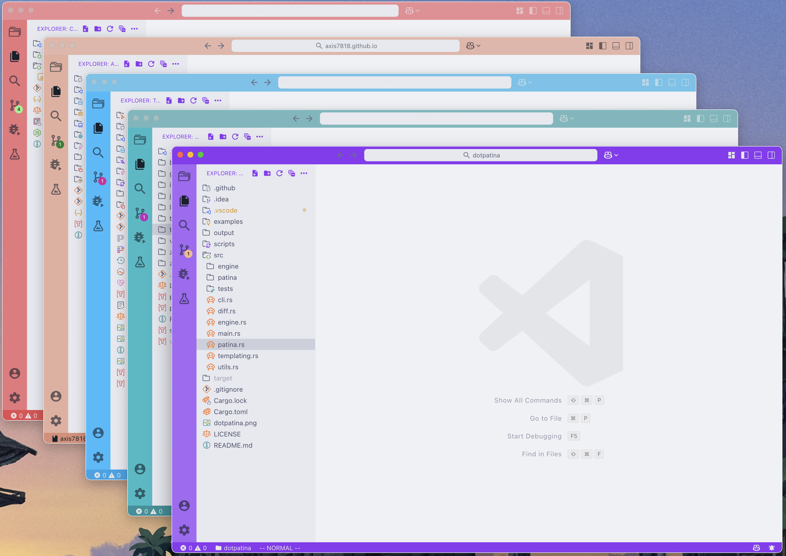

# Catppuccin Peacock Colors

This repo includes Catppuccin color definitions for the VSCode Peacock extension.
It uses the [`@catppuccin/palette`](https://github.com/catppuccin/palette) npm package.

## Usage

1. Install the [VSCode Peacock extension](https://marketplace.visualstudio.com/items?itemName=johnpapa.vscode-peacock).
2. Copy the contents of `catppuccin-peacock-colors.json` to the [`peacock.favoriteColors`](https://www.peacockcode.dev/guide/#favorite-colors) VSCode setting.
3. In VSCode, select a color by using the [`Peacock: Change to a Favorite Color`](https://www.peacockcode.dev/guide/#commands) VSCode command.

## Regenerating Colors

To regenerate colors, run `npm install` and `node src/generate.js`.

To specify which catppuccin flavors to include, modify the `INCLUDED_FLAVORS` value in [generate.js](./src/generate.js)
